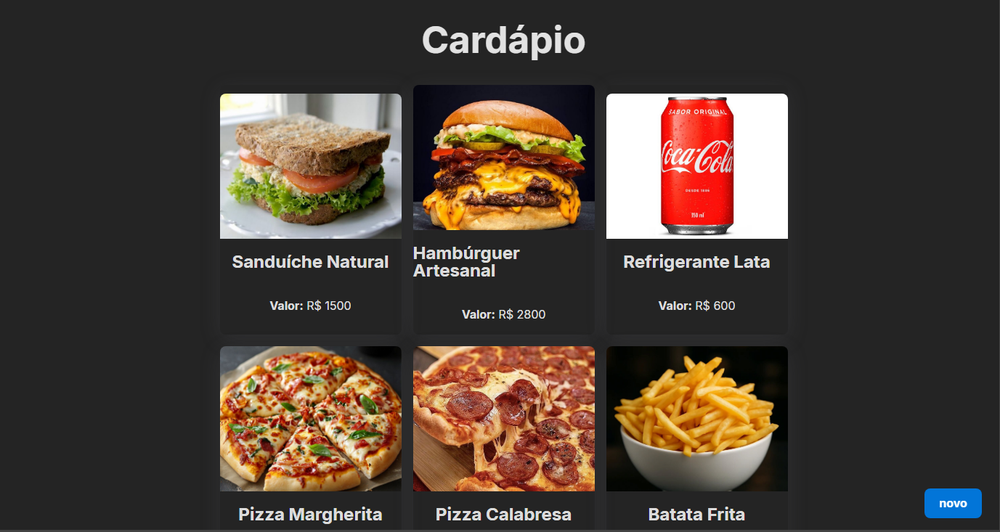

Esse é um projeto fullstack simples para praticar front-end e back-end juntos, front-end usando Vite, React e TypeScript, no back-end foi usado Java, SpringBoot e o PostgreSQL como banco de dados.

